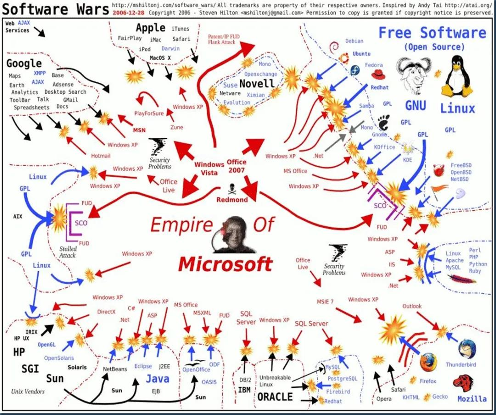

# Bar Index

GitHub 风格的表格
=============

| Tables        | Are           | Cool  |
| ------------- |:-------------:| -----:|
| col 3 is      | right-aligned | $1600 |
| col 2 is      | centered      |   $12 |
| zebra stripes | are neat      |    $1 |

Emoji
=============

:tada: :100:
:hot_face:
:cursing_face:
:space_invader:
:bomb:

目录
=============

markdown.toc        
类型: Object        
默认值: { includeLevel: [2, 3] }

[[toc]]

二级标题1
------------

二级标题2
------------

二级标题3
------------

### 三级标题


自定义容器 
=============

::: tip 提示
这是一个提示
:::

::: warning 注意
这是一个警告
:::

::: danger 警告
这是一个危险警告
:::

::: details 详细信息
这是一个详情块，在 IE / Edge 中不生效
:::

::: details 点击查看代码
```js
console.log("你好，VuePress!")
```
:::


代码高亮
===========

单行高亮
``` js {4}
export default {
  data () {
    return {
      msg: 'Highlighted!'
    }
  }
}
```

多行高亮
``` js{1,4,6-7}
export default { // Highlighted
  data () {
    return {
      msg: `Highlighted!
      This line isn't highlighted,
      but this and the next 2 are.`,
      motd: 'VuePress is awesome',
      lorem: 'ipsum',
    }
  }
}
```


导入代码块
=============

<<< @/tests/code-demo.py{4,10}

:::tip 注意
由于代码段的导入将在 webpack 编译之前执行，因此你无法使用 webpack 中的路径别名，此处的 @ 默认值是 process.cwd()。
:::


静态资源加载
=====================

## 相对路径加载

相对当前 Markdown 文件的路径加载

<!-- 使用 Webpack 别名加载资源   
 -->

**绝对路径加载资源**        


**相对路径加载**        



**Webpack别名**     
<!--  -->

Vue 模板语法
=====================

`内联哈` 呜啦啦啦，

**Vue插值表达式**       
1 + 1 的结果是 {{1+1}}

**Vue指令**     
<span v-for="i in 3">{{ i }} </span>    

**访问网站元数据**      
{{ $page }}

**显示原始`{{}}`**
::: v-pre
`{{ This will be displayed as-is }}`
:::


VuePress内置组件
=====================

**外部链接** [百度一下](https://www.baidu.com)       

**Badge 角标**  
内置组件Badge有三个属性需要传递 
* text：它指明了角标的内容
* type：同自定义容器类似，它有三种不同的类型，分别是tip、warn和error，默认是tip
* vertical：它指明了角标同内容的对齐方式，有两个值，分别是top和middle，默认是top

慎莫念過去<Badge text="亦勿願未來" />       
過去事已滅<Badge text="未來復未至" type="warn" vertical="top" />        
現在所有法<Badge text="彼亦當為思" type="error" vertical="middle" />        


使用自定义Vue组件
======================

<CustomerComponent />   